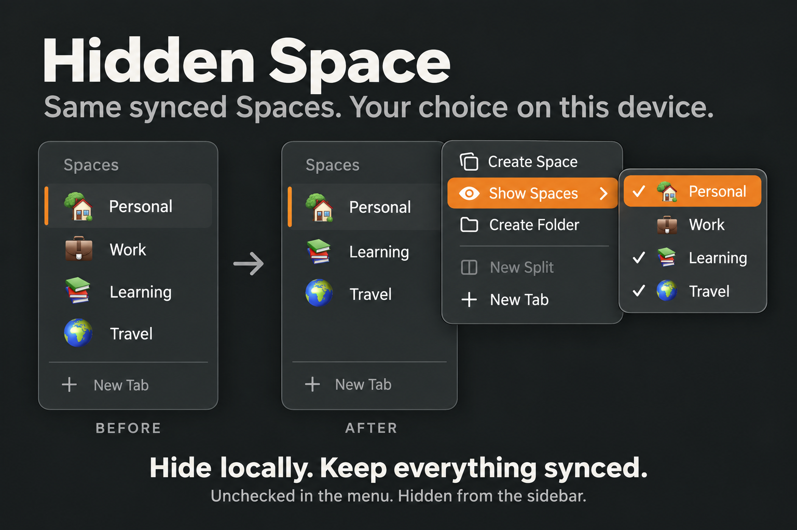
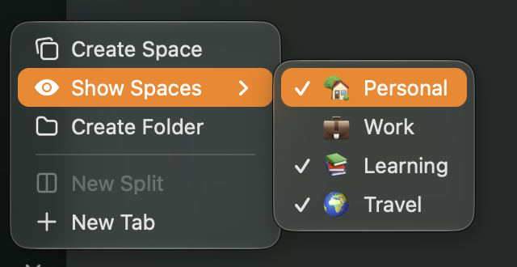
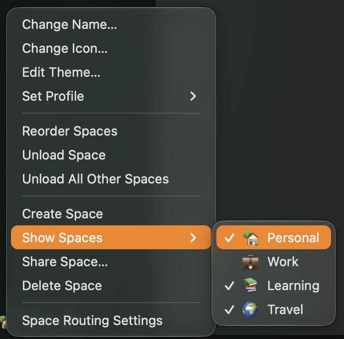
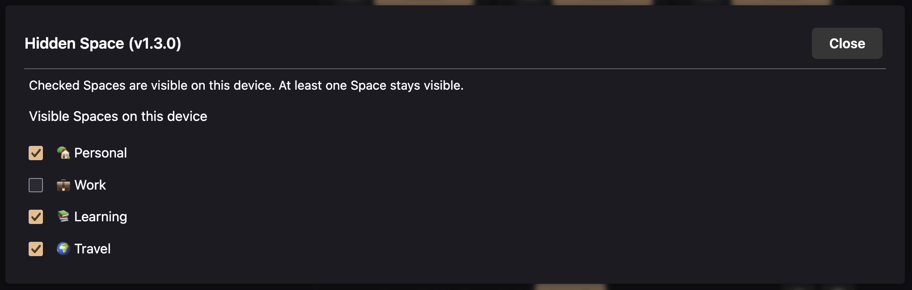

# Hidden Space

Hide selected Zen Spaces on this device while keeping them synced.

Use work and home Macs with the same synced Spaces, then choose which ones each Mac shows. Hidden Space changes the browser UI. It never deletes, moves, or removes Spaces or tabs from sync.



Illustration of the local visibility change. Actual menu screenshots are below.

## Use

Open **Show Spaces** from the **+** menu or by right-clicking a Space. In the context menu it sits between **Create Space** and **Share Space**.

Check a Space to show it on this device; uncheck it to hide it. Each row includes its Zen icon and name. The checklist in Sine settings uses the same convention. No IDs to copy.

The last visible Space cannot be hidden through the menu. If a manually edited list hides everything, the first Space stays visible. Hiding the active Space switches to an available Space.

Hidden Spaces disappear from the Space icon strip and native Space menus. Next/previous Space navigation skips them. Direct shortcuts to a hidden Space stay in the current visible Space. Check a Space in Show Spaces before opening it intentionally.

## Screenshots

The same checklist is available from the + menu, a Space's context menu, and Sine settings.







Screenshots use sample Spaces in a separate profile. A checked Space is visible on this device; an unchecked Space remains synced but is hidden here.

## Startup

**Open previous windows and tabs** restores the session. Zen's **Continue where you left off** additionally selects the last active tab instead of starting on a blank/home page.

If a restored Space is hidden here, Hidden Space selects the first visible Space. The mod checks again after Zen finishes restoring its session. It always leaves at least one Space visible.

Tested with real restarts on Zen 1.22.1b, with a hidden Space and its tab saved as active: both settings recovered to a visible Space. With Continue enabled, a tab in that visible Space was selected; with it disabled, Zen selected its blank start page. This was an isolated local restore test, not a two-device sync test. A brief startup flash before the mod loads is not ruled out.

## Local settings

Selections are saved by Space ID in this Zen profile, so renaming a Space keeps its selection. Configure each machine separately. New synced Spaces appear until you hide them.

- `uc.hidden-space.ids`: comma-separated Space IDs, managed by the settings list and Space menus.

The mod explicitly opts these preferences out of Firefox preference sync. It does not alter Zen's Spaces Sync records. Copying a browser profile manually also copies its local preferences.

This is visual filtering, not a privacy boundary. Tabs still exist locally and remain synced. Search, history, synced-tab lists, and other extensions can still expose them. Shared Essentials remain available.

## Install with Sine

Add `kkugot/hidden-space` through Sine's custom repository installation and enable the mod's JavaScript when prompted. For a local or custom repository install, turn on Sine’s **Enable installing JS from unofficial sources** setting (`sine.allow-unsafe-js`). This is Sine’s permission for JavaScript in all enabled non-store mods; Hidden Space does not modify Sine. Store installs do not need this setting. Requires Sine with chrome script support. Runtime-tested with Zen 1.22.1b.

### Local development

From this checkout, register a symlink in an existing Sine profile:

```sh
python3 scripts/install.py "/path/to/Zen/profile"
```

The installer backs up `chrome/sine-mods/mods.json`, registers the mod, and disables automatic updates for the symlink. It refuses to overwrite an existing mod directory or a link to a different checkout. Restart Zen after installation. No Spaces are selected automatically.

To disable, turn off Hidden Space in Sine. Disabling restores the controls and native navigation immediately. To remove the development link manually, remove only the `hidden-space` symlink and its registry entry, keeping the checkout.

## Development

No dependencies or build step. Sine loads `hidden-space.uc.js` directly. `space-picker.uc.js` adds the live checklist to Sine’s settings dialog. The browser script owns its stylesheet, menu, preference observers, and two navigation wrappers; unloading restores them. It does not filter `getWorkspaces()`, because Zen uses that list for storage and sync.

```sh
node --check hidden-space.uc.js
node --check space-picker.uc.js
node --test tests/hidden-space.test.cjs
```

See [runtime validation](tests/README.md) for browser checks and limits.

Author: Kostiantyn Kugot. [MIT license](LICENSE).
